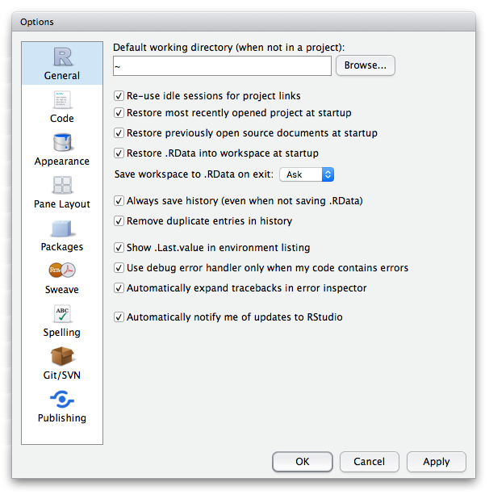
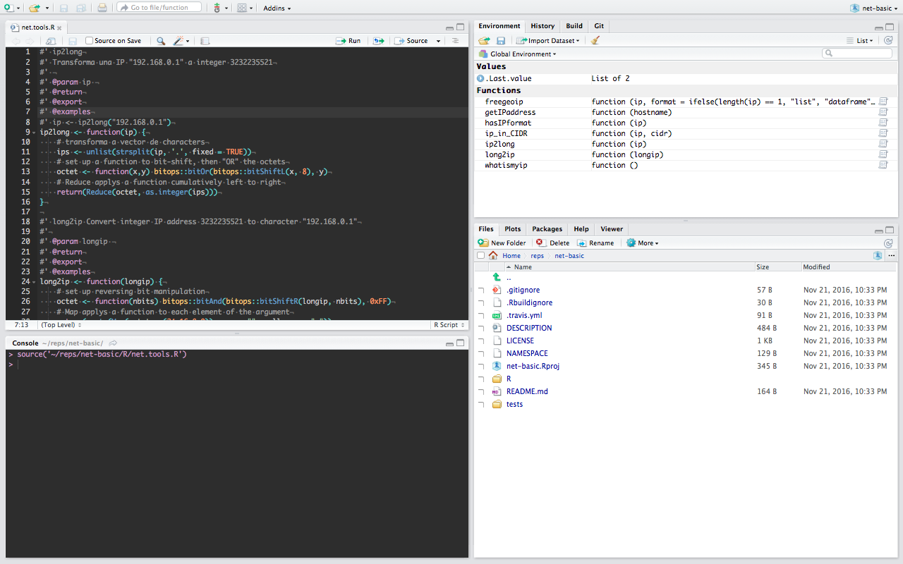
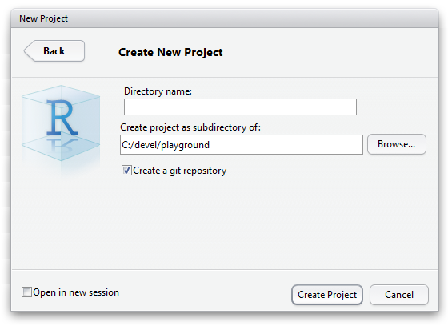
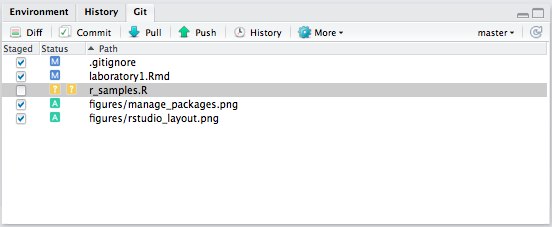
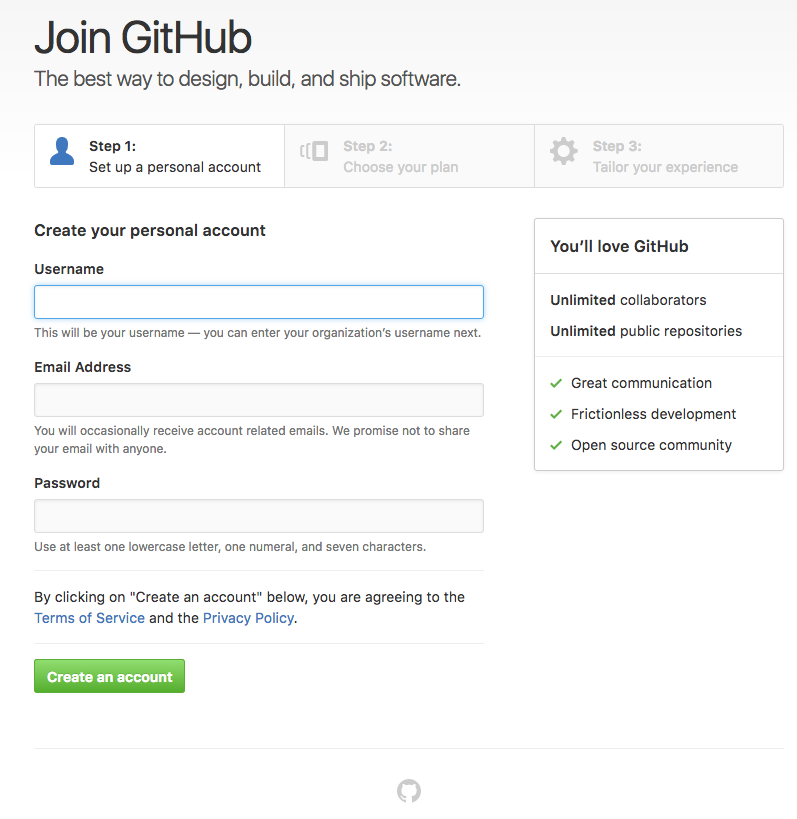
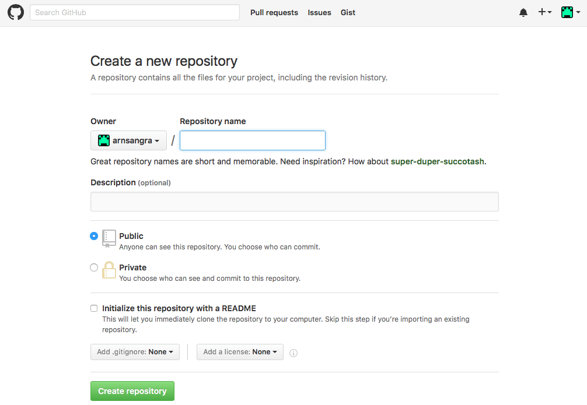
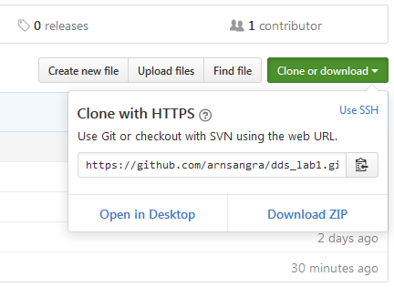
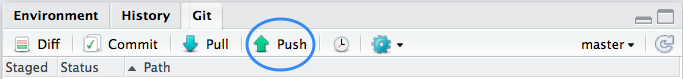
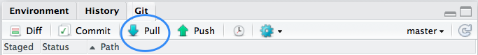
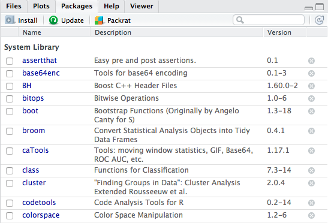

```{r setup, include=FALSE}
knitr::opts_chunk$set(echo = FALSE)
knitr::opts_chunk$set(fig.align = 'center')
```


```{r bootstrap, message=FALSE, warning=FALSE, include=FALSE}
if (!suppressMessages(suppressWarnings(require("plyr", quietly = T)))) {
  suppressMessages(suppressWarnings(install.packages("plyr", repos = "http://cran.rstudio.com/", quiet = T, dependencies = T)))
}
if (!suppressMessages(suppressWarnings(require("dplyr", quietly = T)))) {  
  suppressMessages(suppressWarnings(install.packages("dplyr", repos = "http://cran.rstudio.com/", quiet = T, dependencies = T)))
}
if (!suppressMessages(suppressWarnings(require("ggplot2", quietly = T)))) {
suppressMessages(suppressWarnings(install.packages("ggplot2", repos = "http://cran.rstudio.com/", quiet = T, dependencies = T)))
}
```

``` {r themes, echo=FALSE, eval=FALSE}
themes <- "default", "cerulean", "journal", "flatly", "readable", "spacelab", "united", "cosmo", "lumen", "paper", "sandstone", "simplex", "yeti"
```

## About the laboratory...

Data Driven Security aims to provide an introduction to computer security , but from a different perspective.

The goal of the subject is to make you not only aware of the implications of the analysis of security information data but also capable to at least explore such data and extract valuable information in a effective way using the correct methodology.

Throughout the laboratories, the theory seen at class will be put in practice in conjunction with other tools and technologies related to the topic. As result, each laboratory will provide you more powerful tools that usually rely on the previous ones, thus, it is specially important to complete proposed exercices as well as understand the concepts.

---

&nbsp;

# R Language xxx

```{r r_logo, out.width = "150px"}
knitr::include_graphics("figures/Rlogo.png")
```

The language used in this subject is ...*R*. As seen in theory, there are plenty of reasons to use this programming language for the tasks where are about to do.

* Ideal for data analysis:
    + Powerful
    + Numerous libraries available
    + Easy graphics generation
* Great community of developers
* Open Source

## Hello World!

Following the tradition, the very first program to code with a new language is the well known _Hello World!_, which shows how to print a salute.

In R, it would look like this:

```{r hello_world, echo=TRUE}
print("Hello World!")
```

which unsurprisingly, prints the famous welcoming phrase.


## Looking for help

When progamming, and specially when using a new language, it often happens that we do not know exactly how to make use of the functions that implement the feature we are willing to use.

Fortunately, the comunity of R developers usually provides a great documentation alongside with the package, so that there is a good description of what does the function do, which parameters accept.

To display the help for a given function, just type a question mark before the name of the function in the Console:

```{r look_for_help, echo=TRUE, eval=FALSE}
?help
# show help for 'help' function
```

Moreover, documentation usually includes examples with the most common uses.

- _Look up the documentation for the function print()_

--------

# R Studio

```{r rstudio_logo, out.width = "200px"}
knitr::include_graphics("figures/RStudio-Logo-Blue-Gradient.png")
```

Before actually getting our hands dirty writing our R programs to analyse data, it is a good step to familiarize with the environment we will be using.

Although it is possible to write R programs in any modern programming editor, the best environment where to code and execute the R scripts is undoubtedly **R Studio**.

This IDE (integrated development environment), available for all major platforms, including Windows, macOSX and many Linux distributions, provides a unique framework to develop R programs in a easy but powerful way. Among the numerous features, RStudio integrates a good source editor and a R interpreter where to run the code.

Moreover, it also has support for different version control systems like git and svn, in addition to the set of tools more strictly related to the R language such as the environment inspector, the package manager or the plot and the help viewer among others.

## Configure settings

Firstly, as a way to know your new IDE, it is very recommendable for you to inspect the preferences and set them accordingly to your requirements.

As a good practice and in order to prevent future errors everyone should agree on a minimal configuration:

```{r rstudio_settings, out.width = "500px"}

```

- _Open preferences: (Linux/Windows: Edit -> Preferences, OSX: RStudio -> Preferences)_

- Under _Code_ section, make sure the following options are checked out:
    + use _tabs as spaces_, width 2
    + set _soft wrap_
    + set _Strip trailing horizontal whitespace_
    + Saving tab: _Line ending conversion "Posix (LF)"_
    + Diagnostics tab: _Enable *all* R diagnostics checkboxes_

* Other useful settings:
  + Highlight word, currently selected line, R function calls
  + show margin (80)
  + RMarkdown:  	-Show output preview in "Viewer Pane"


## Exploring the layout

The main RStudio window is divided into 4 different sections that contain the main different tools that compose the application.

Note that it is possible to customize the layout of the window so that different sections are arranged differently than default.

*Source* and *Console* sections represent the areas where we will be spending most of the time. Within _Source_ area, we can view all currently opened files and write our scripts as well.

On the other hand, the console section provides us with an R interpreter so that we can test our code as much as needed until it works.

```{r rstudio_layout, out.width = "600px"}

```

It is not necessary to copy and paste our program's lines from Source to Console in order to execute. By using _Ctrl + Enter / Cmd + Enter (macOSX)_ we can evaluate the selected line from source and we will either immediately see the output within the Console or the result of the execution in the Environment section.

By default, the other two sections grouped beside the Source and the Console, include the Environment inspector and the history browser in one pane, and the File Inspector, the package manager and the Plots and Help Viewer in the other.


## Debug code

One of the best advantages of using RStudio over other editors is the possibility to easily debug our programs through its integrated debugger.

It allows us to set breakpoints to anywhere in our program so that we can pause the execution at any moment and inspect the environment in this precise moment.

- _Try setting a breakpoint in any line from the function provided. Then execute those and see what happens._

You should see how the console stops at a certain point. At this moment, the environment section from RStudio should contain all the objects and their content at the very moment of the execution error.
Moreover, you can also navigate through the stack of environments if any.

-------

# Git Basics

```{r git_logo, out.width = "200px"}
knitr::include_graphics("figures/git.png")
```

## Create a _hands on_ project with R Studio

Until now, we have seen a brief introduction to R language and the RStudio IDE, the editor we will be using to create our programs. Now, it is time for us to create our first project, that is, the set of files that will comprise our code, alongside with the configuration settings and any other thing related to our program.

Since we know a little about [Git](https://git-scm.com/), the VCS, we will be using in this course, and is very likely that at some point we might be interested to share our code, inspect and revert our code to a functional version and more importantly, to be able work effortlesly with other people simultaneously, it is a great idea to make our R project a Git project too.

To do so, just go to File -> New Project, and select the option "New Directory" and "Empty Project". Make sure to checkout the "create a git repository" checkbox.

```{r new_project, out.width = "500px"}

```

That's it. We now have our first R project, the collection of files that are related to our program.

Notice how a file with _.RProj_ extension has been added to the root of our project folder. It contains the configurations we set for our project.

Since we have selected the checkbox to create a _git_ repository, RStudio has also initialized our project as a local repository, so that we can start making changes, adding features and commits and all that sort of things related to Git.

- _Create a new R file (a normal file with .R extension). Write some R code. If you don't have any idea, you can always copy the following R program:_

```{r r_sample, echo=TRUE, eval=FALSE}
# This is my first R program
print("Hello World!")

subject   <- "data driven security"
language  <- "R"
print(paste("This is a hands on project written in",
            language,
            "for ",
            subject,
            "subject",
            sep = " "))
```

## Commit changes

Once you have added some R code, you can start by adding all the changes made to files to the staging area, where it will remain until it is finally commited.

```{r staging_area, out.width = "500px"}

```

Remember that RStudio provides an easy way to stage the files within the Git tab, where by default it shows all the files for your project, allowing you to stage and unstage.

- _Finally, create at least one new commit. Remember to include a relevant commmit message regarding the changes included._

## Create remote repository on Github

Although git allows you to work only using a local repository, all the advantages come with the existance of a remote repository to where to push the commits hence allowing others to get the changes we make.

To create a remote repository we will be using _[GitHub](https://github.com/)_, a freemium repository service on the Internet, where to store our code.

- _Sign up to Github_

```{r sign_in_github, out.width = "600px"}

```

- _Create your first repository. To make things easy, name it equally to the R project we have just created._


```{r new_github_rep, out.width = "600px"}

```

Once you have crated the repository, we must somehow establish the relation between our R project (which is also the local git repository) and the remote repository before we can actually send our commits to the Github repository.

## Link local and remote repositories

In order to share our code, for instance, with any team developer, since each one will use its own local remote it is necessary to link each local repository with the central remote (the one provided by GitHub).

In this matter, Despite the existance of other VCS prgrams offer a graphical interface to easily set the direction of the remote repository, RStudio still does not provide it unless we initially clone an R project directly from a remote.

In this particular case, it will be necessary to manually run the git commands on a shell to establish the remote configuration.

_First of all we must obtain the remote address:_

```{r get_remote_rep, out.width = "400px"}

```

_Then, open a terminal within the project folder and run the git command to set the direction of the locale_

```{sh add_origin, echo=TRUE, eval=FALSE}
# substitute '<remote repository address>' with the address copied from GitHub.
git remote add origin <remote repository address>
```

If remote address is correct (https or ssh preferably), our local git repository now is aware of the remote repository.

## Push to remote

Despite the fact of adding the address of the remote, it is still impossible to share our changes.

Before pushing local commits we must first specify to which branch we want to send our changes, i.e. it is still necessary to link the _local master branch_ with the _remote master branch_.

```{sh push_to_remote, echo=TRUE, eval=FALSE}
git push --set-upstream-to=origin/master
```

After issuing the previous command, not only we will have established the relation between the master branches (local and remote) but also have send the latest changes made in our local repo to the remote.

```{r push_button, out.width = "500px"}

```

From now onwards, the next time we will want to publish the commits made from the local repository to the remote, a simple push will be enough. Since this is a very common action, the green upwards arrow from the git pane send the new commits to the remote so that other developers can fetch it.

## Pull from remote

Lastly, in case we are interested to retrieve the lastest commits pushed to the team remote repository and integrate this to our code, we can use the git command pull.

Similarly to the push action, in RStudio, the blue down arrow from the git pane triggers the pull from the remote.

```{r pull_button, out.width = "500px"}

```

--------

# Packages

Packages play a fundamental role in the development of R applications. Written by the R community, provide functionalities already implemented and ready to be used within our programs. Most of the best packages or libraries are publicly avaiable on [CRAN](https://cran.r-project.org/) (the Comprehensive R Archive Network), a very extensive repository for R packages.

However, since CRAN impose certain standards and good practices to ensure certain minimum quality, packages can also be retrieved from other source. The other main alternative for R packages is Github.
There we can find not only the those packages that do not satisfy the CRAN requirements yet, but also the latest bleeding edge versions of most packages.


## Manage installed packages with RStudio

To manage installed packages, once again, RStudio provide an easy GUI interface that facilitates the administration of the packages. Though it, it is possible to view all already installed packages, install new ones (from CRAN or local folder), update and uninstall.

```{r, out.width = "500px"}

```


- _Try installing some of the very useful packages, that are not part of the R core:_
    * `xml`
    * `lubridate`
    * `stringr`


## Using installed packages

Once a package has been installed, in order to use the functions that export, i.e. the features that we want to use, we must firstly load into memory so that it can be actually used.

To do so, it is as simple as including the installed package within our program.

```{r load_package, echo=TRUE, warning=FALSE}
library("ggplot2")
# now we can use functions exported by this package
```

```{r, echo=T, cache=TRUE}
if (!file.exists("db")) {
  exploitdb_url <- "https://github.com/offensive-security/exploit-database/raw/master/files_exploits.csv"
  #exploitdb_url <- "https://raw.githubusercontent.com/offensive-security/exploit-database/master/files.csv"
  download.file(exploitdb_url, destfile = "db")
}
db <- read.csv("./db", header = T)
db_aggr <- dplyr::count(db, platform, sort = T)
ggplot(db_aggr, aes(x = "", y = n, fill = platform)) + geom_bar(width = 1, stat = "identity")
```

This way, we will be able to call the different functions in our code.

For example, using dply and ggplot, we can easily see the top platforms with more vulnerabilities

```{r, echo=T, cache=TRUE}
db_aggr <- dplyr::count(db, platform, sort = T)
ggplot(head(db_aggr), aes(x=platform, y=n, fill=platform)) + geom_bar(stat = "identity")
```

---------

# Experimenting with the language

Until now, we have seen the very basics over which we will build up the future laboratories. In order to familiarize with the R world, it is necessary to practice a little more.

Since following labs will presuppose certain knowledge of R, you should complete the swirl introduction, as it represents a great introduction to the language itself, in a interactive and guided way.

1. _Install Swirl package (either use the packages pane or following R instruction on the console):_

```{r install_swirl, echo=TRUE, eval=FALSE}
if (!require("swirl")) {
  install.packages("swirl", repos="http://cran.rstudio.com/", quiet = T)
}
```

2. _Load the just installed package:_

```{r load_swirl, echo=T, eval=FALSE}
library("swirl")
```

3. _Launch swirl and complete the tutorial:_

```{r launch_swirl, echo=TRUE,eval=FALSE}
swirl()
```

---

# Complementary references

- [RStudio Cheatsheet](https://www.rstudio.com/wp-content/uploads/2016/01/rstudio-IDE-cheatsheet.pdf)
- [Git Cheatsheet](http://files.zeroturnaround.com/pdf/zt_git_cheat_sheet.pdf)
- [Interactice Git Tutorial](https://try.github.io/levels/1/challenges/1)
- [Interactive R Tutorial](http://tryr.codeschool.com/)
- [Git Book](https://git-scm.com/book/en/v2)
